## 1. Project Description
- The Student Profile application is a multi-page portfolio website packaged with Apache Cordova. The application presents a personal overview, skills, academic background, projects showcase, and contact information.

## 2. Application Pages
### index.htmml
- Serves as the landing homepage featuring a primary hero title, quote, introductory profile image, and personal summary. 

### about.html 
- Academic background, web development goals, hobbies, and background aspirations.. 

### skills.html
- It talks about what I learned (and still learning) and the things I'm capable of doing. It has a generic desktop image on the side or below depending on what device you are using

### education.html
- academic standing 

### projects.html
- Features project cards specifying project titles, descriptions, developer roles, and live links.

### contact.html
- Direct communication channels including GitHub profile link, facebook, and email address.

## 3. Navigation
- Navigation is implemented through a fixed header element (<header class="site-header">) containing a navigation menu (<nav class="site-nav">) present across every HTML page.

## 4. Responsive Design 
- Desktop: Displays content within a constrained max-width container (1000px). Side-by-side structures, such as two-column layouts for the skills section
- Tablet: Adapts grid layouts dynamically using media queries (@media (min-width: 600px)) to preserve visual spacing and image aspect ratios.
- Mobile: Custom body top and bottom padding (padding-top: 110px) prevents fixed headers and footers from blocking page content.

## 5. UI/UX Principles Applied
- Visual Hierarchy: Distinct card wrappers, bold headers, and accent colors.
- Consistency: Consistent color schema through all pages and typography
- Feedback & Accessibility: Navigation buttons feature interactivity

## 6. How to Run
Provide the necessary steps for building and running your Cordova application:

```bash
cd your-project-folder
cordova platform add android
cordova build android
cordova run android
# Or use the emulator
cordova emulate android
```

## 7. Application Screenshots

### Desktop
#### Homepage
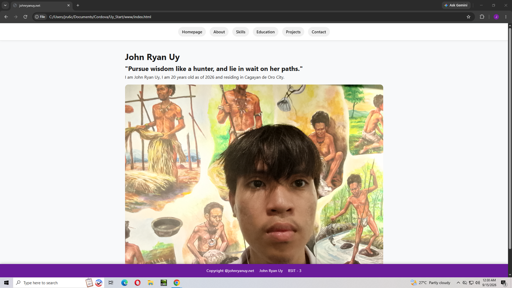
#### About
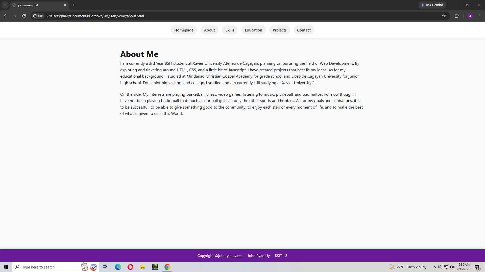
#### Skills
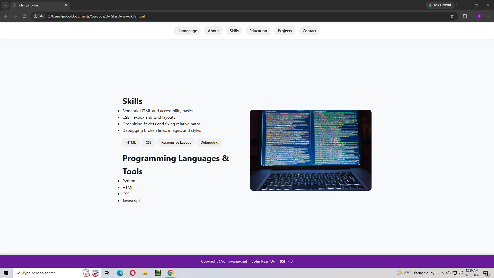
#### Education
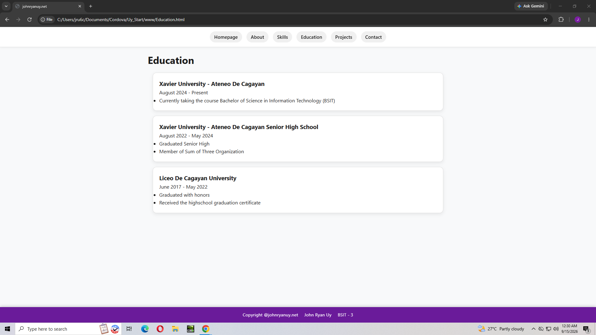
#### Projects
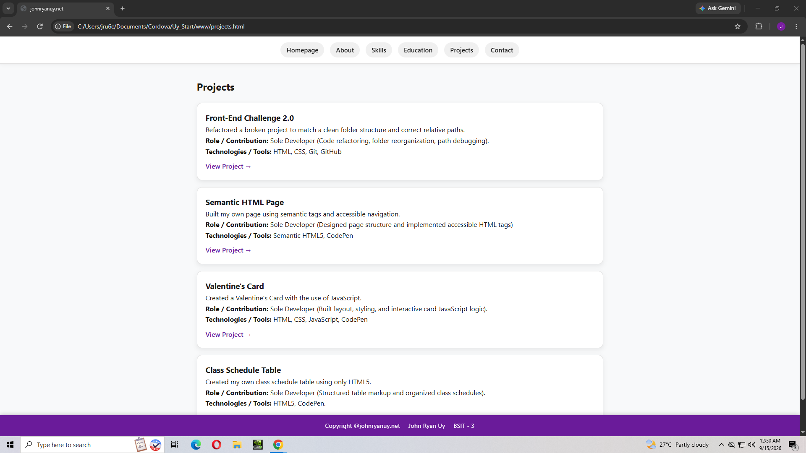
#### Contact
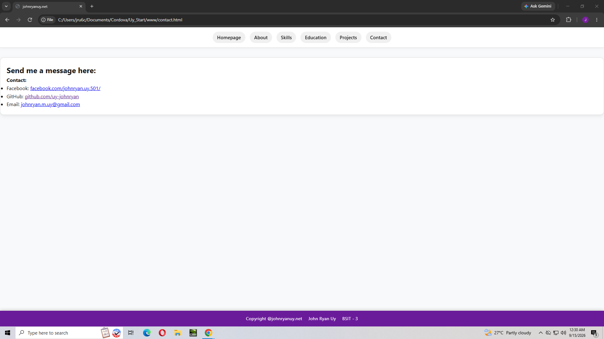

### Mobile
#### Homepage
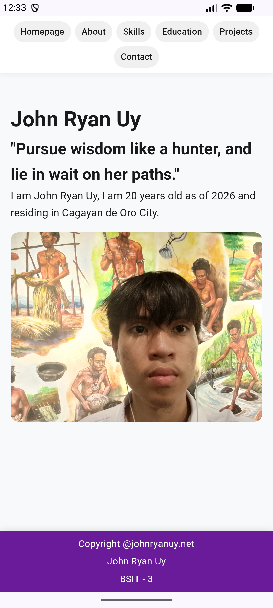
#### About
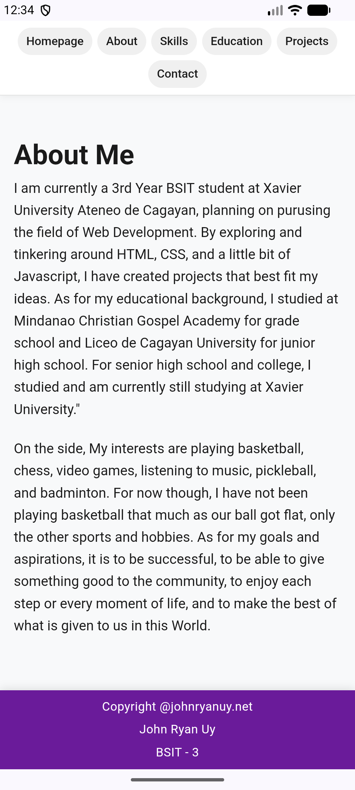
#### Skills
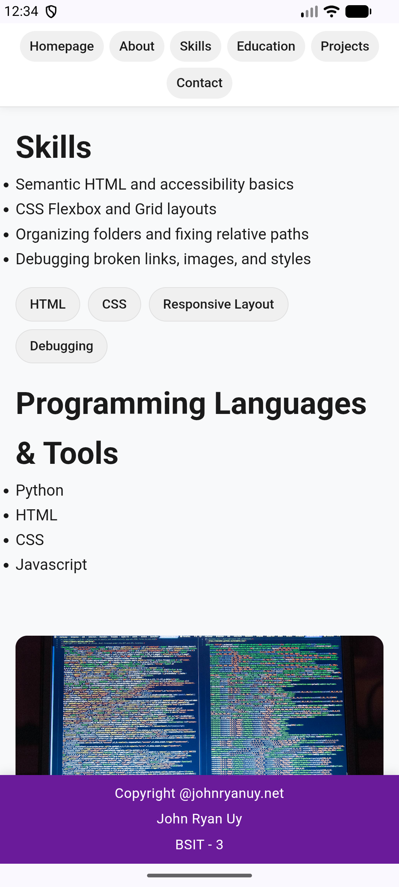
#### Education
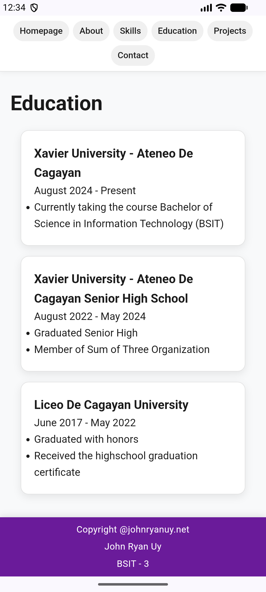
#### Projects
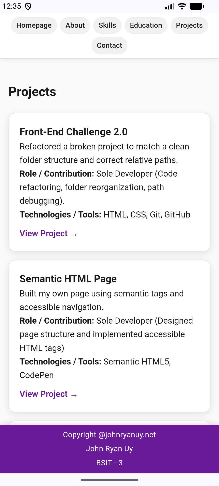
#### Contact
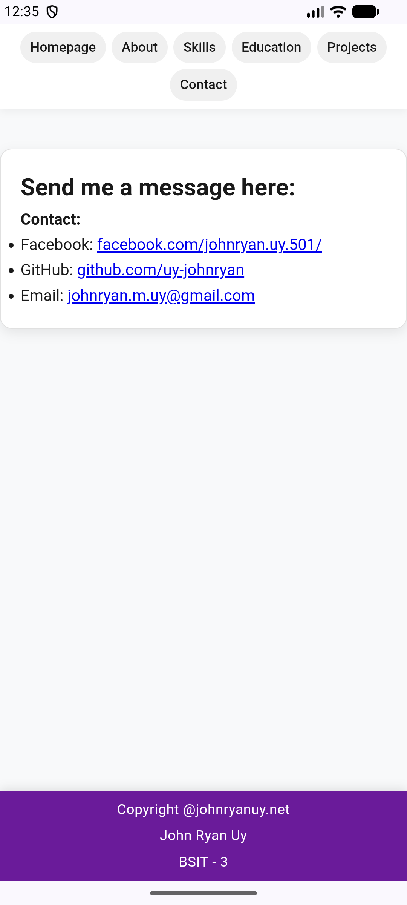

### Tablet
#### Homepage
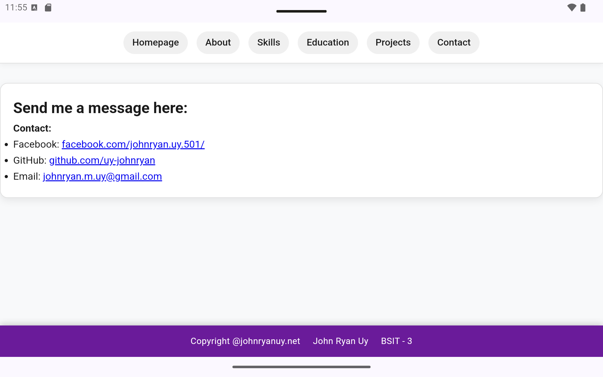
#### About
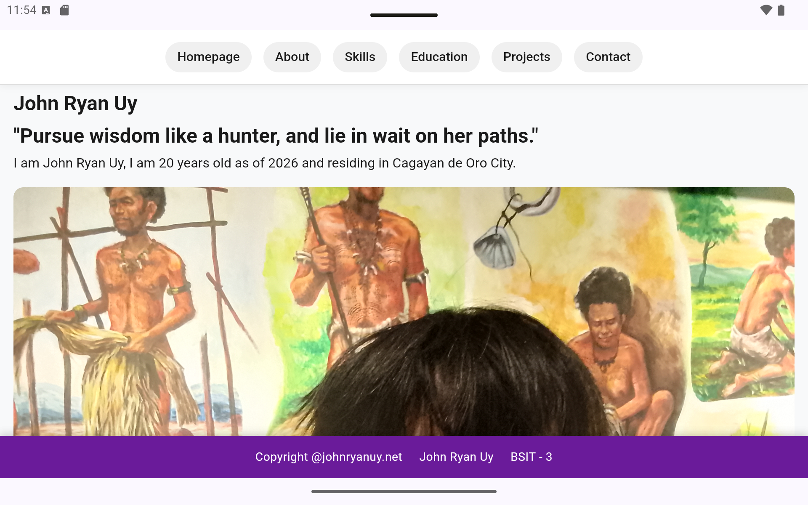
#### Skills
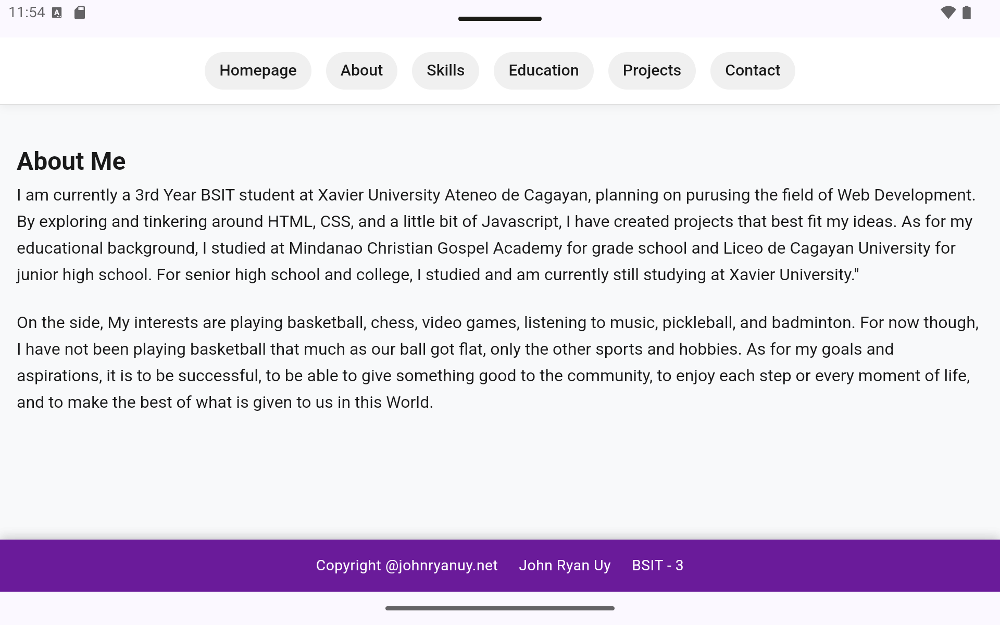
#### Education
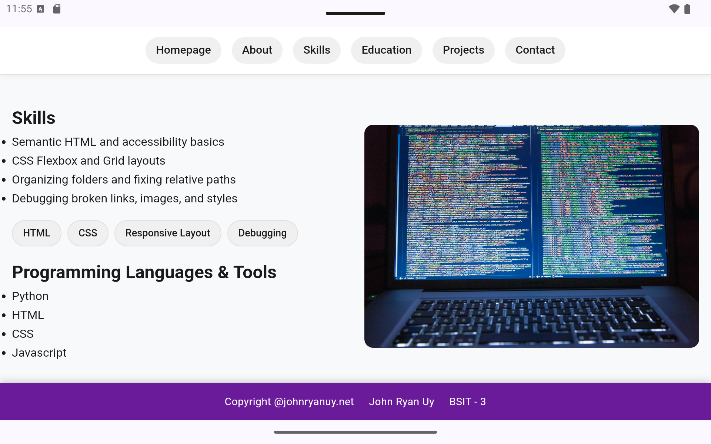
#### Projects
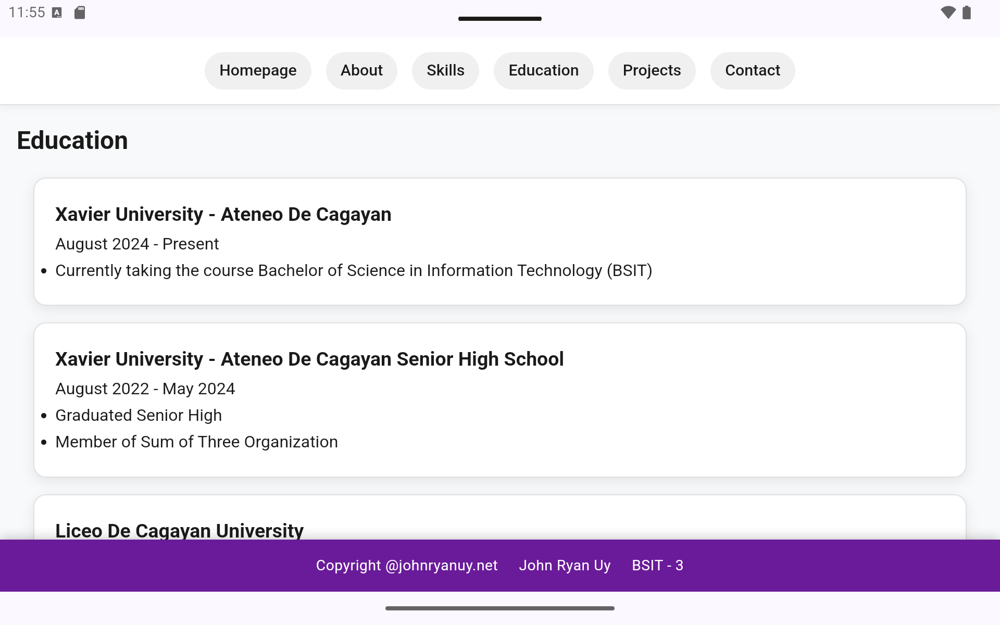
#### Contact
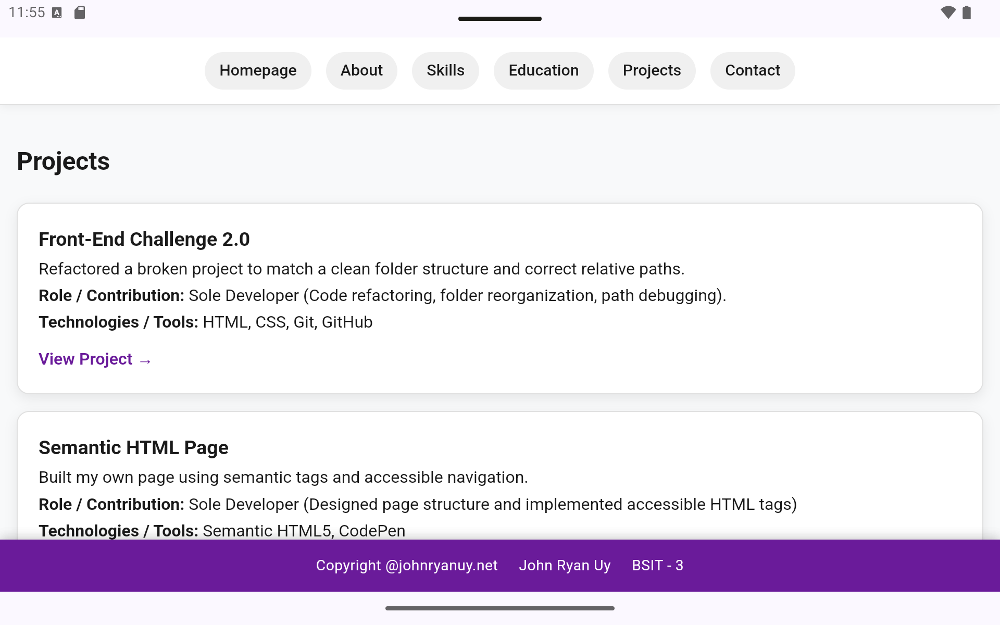