# Student Profile Application

## 1. Project Description
- My profile application is simple and uses a flexbox layout to have responsive design on multiple devices.

## 2. Application Structure

### Header
- This is where I put my navigation menu. It is text on padding with a color purple hue. 

### Navigation Menu
- My navigation menu is on the header of the site, meaning it stays on top for easy navigation. It has labeled buttons that when clicked redirects to a section of the same page. 

### About Section
- It is information about myself. What course I take, my age, my interests and my goals or aspirations. This is written in 2 paragraphs. I also have a picture of myself and my contact details here.

### Skills Section
- It talks about what I learned (and still learning) and the things I'm capable of doing. It has a generic desktop image on the side or below depending on what device you are using.

### Footer
- This is where a copyright notice is put, my name and my current year. The text is put on a color purple footer and aligned on the center with padding for spacing. 		

## 3. Responsive Design
- I made it thinking of what a user will want to see when they see a student profile and by that, I made it simple with clear typography and I made sure the design was consistent using color hues white, black text, and purple.

## 4. UI/UX Principles Applied
- I used clear text so it's easy to read, consistent design through the use of similar colors. Usable controls such as the navigation bar for each section of the page. I also used a flexbox layout to have it be responsive for multiple devices. It's mobile friendly as text is clear and can fit well to mobile. 

## 5. Navigation
- When you click on the navigation bar it redirects you to the selected section of the same page.

## 6. How to Run
Provide the necessary steps for building and running your Cordova application:

```bash
cd your-project-folder
cordova platform add android
cordova build android
cordova run android
# Or use the emulator
cordova emulate android
```

7. Application Screenshots

### Desktop
#### About me
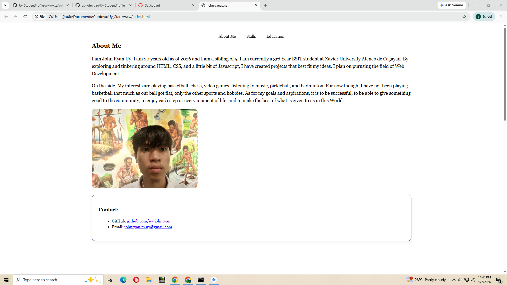
#### Skills
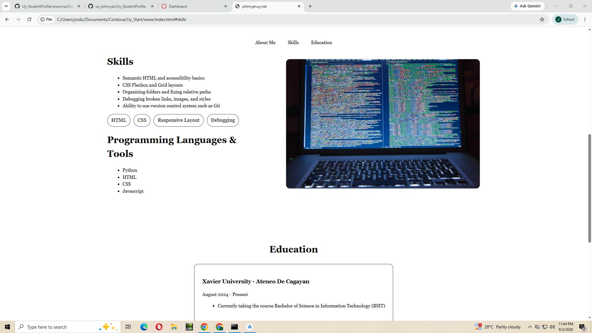
#### Education
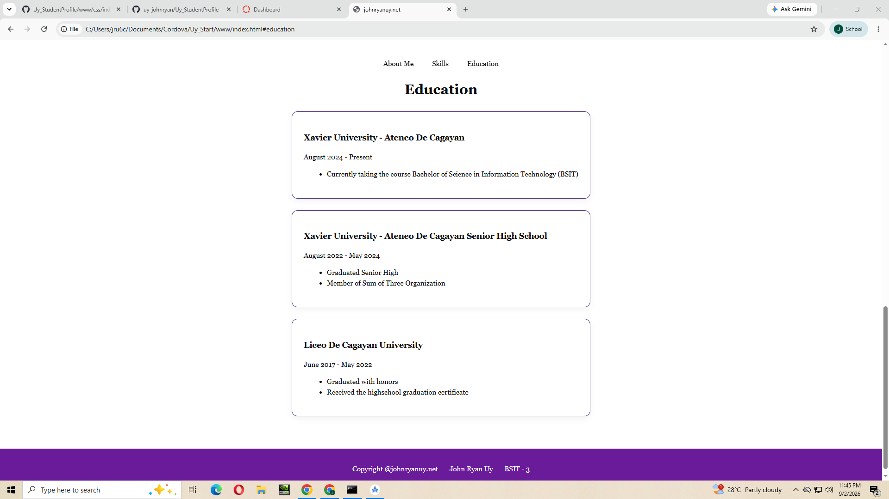

### Mobile
#### About me
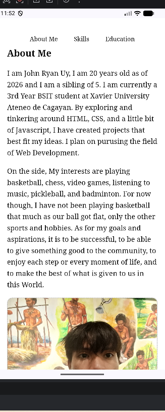
#### Skills
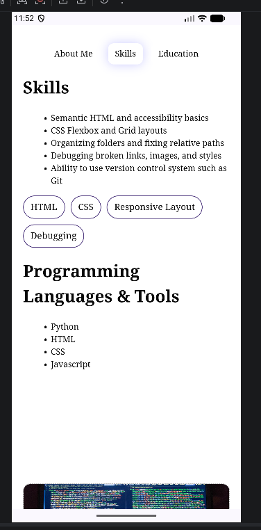
#### Education
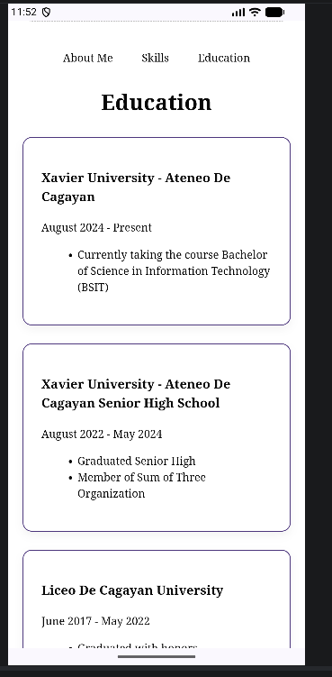
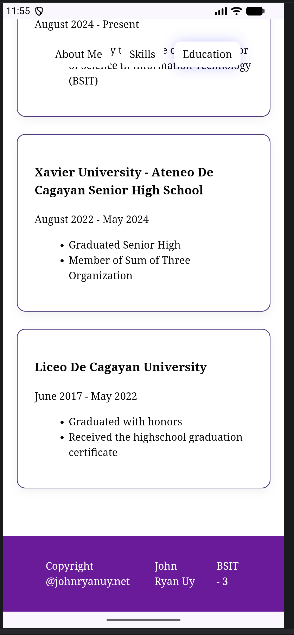

### Tablet
#### About me
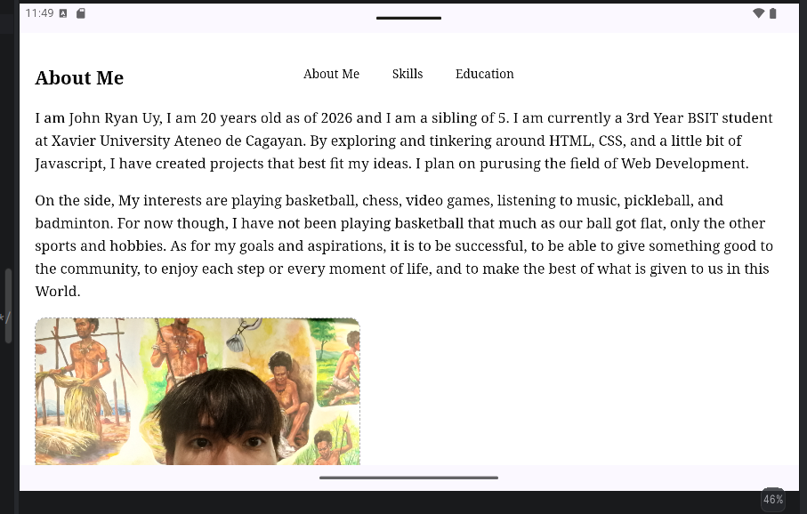
#### Skills
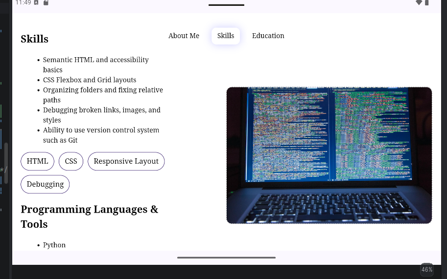
#### Education
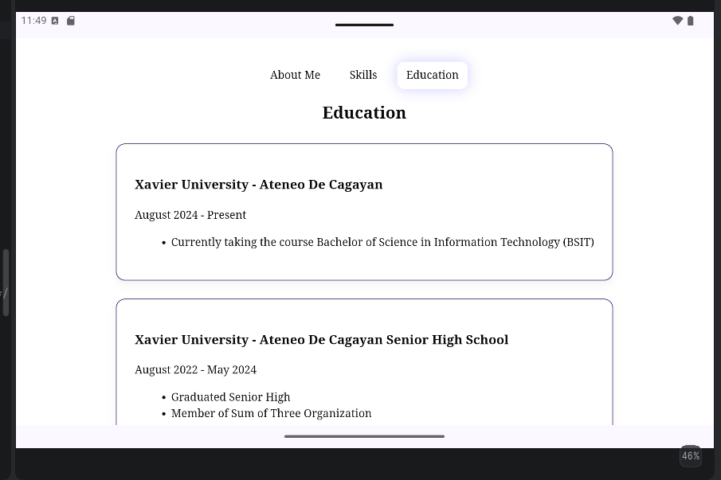
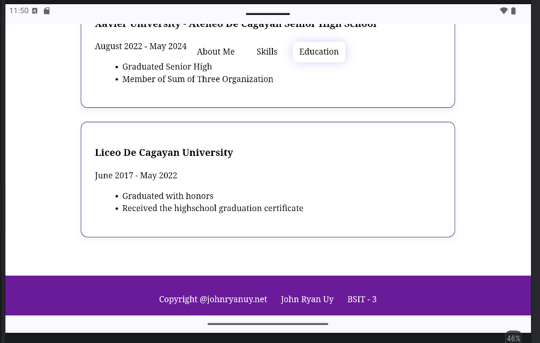