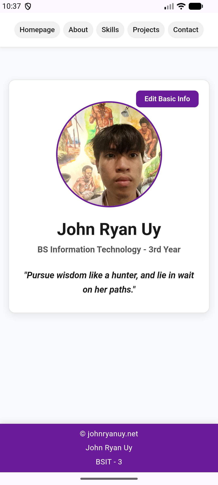
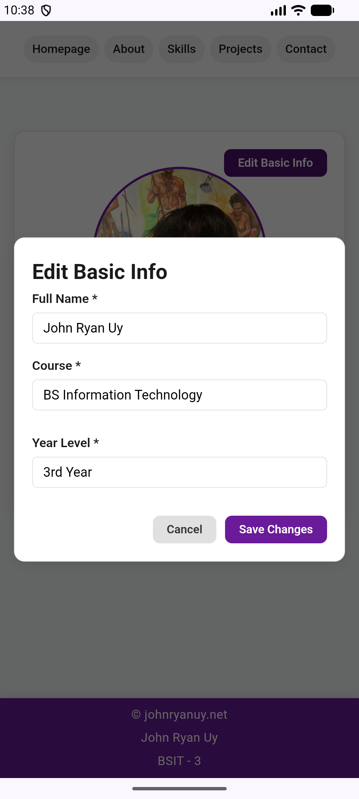
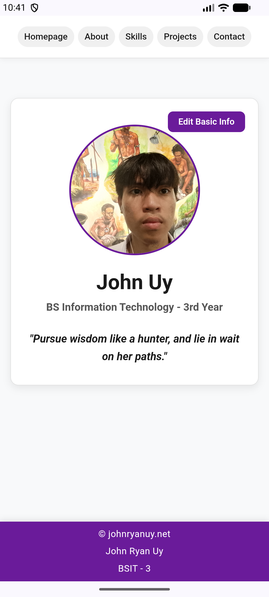
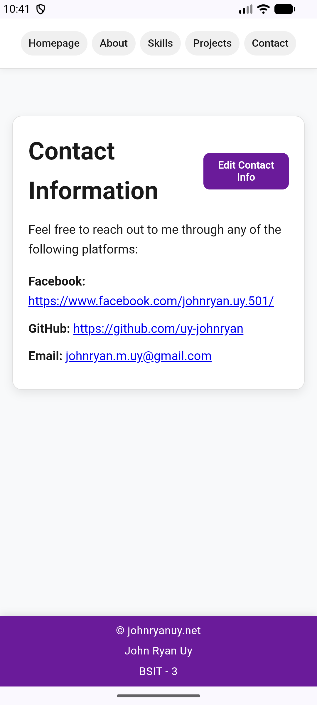

## 1. Project Description
- The Student Profile application is a multi-page mobile application website built with HTML5, CSS3, JavaScript, and packaged with Apache Cordova. The application presents a personal overview, skills, academic background, projects showcase, and contact information.

## 2. Application Pages
### index.html
- Serves as the landing homepage featuring a, quote, introductory profile image, and personal summary. 

### about.html 
- Academic background, web development goals, hobbies, and background aspirations.. 

### skills.html
- It talks about what I learned (and still learning) and the things I'm capable of doing. It has a generic desktop image on the side or below depending on what device you are using

### projects.html
- Features project cards specifying project titles, descriptions, developer roles, and live links.

### contact.html
- Direct communication channels including GitHub profile link, facebook, and email address.

## 3. Profile Editing
The Edit Profile functionality provides a seamless inline transition from view mode to form input mode:

- How it works: Clicking the "Edit Profile" button toggles the view to render editable input controls pre-populated with current profile data.
- Modifiable Information:
    - Full Name
    - Course / Program
    - Year Level    
    - Short Bio / About Summary
    - Skills List 
    - Contact Details

## 4. JavaScript Functionality
JavaScript controls the dynamic interactivity and user interface logic across the application without requiring full page reloads:

* **Form Handling:** Intercepts standard HTML form submissions (`e.preventDefault()`) to capture user input cleanly and process data asynchronously.
* **Validation:** Checks required form fields before processing. If any mandatory field is empty, the script blocks submission and displays a clear error banner.
* **Profile Updates:** Replaces DOM elements in real-time (`textContent`, `href`, and dynamically created `<li>` elements for skills) so changes display immediately upon saving.
* **Save:** Combines updated inputs into a structured JavaScript object, saves the updated data to local storage, updates the view, and dismisses the modal form.
* **Cancel:** Closes the modal interface instantly without saving changes, resetting input fields back to their previously stored state.

## 5. Local Data Storage
The application uses the browser's built-in `localStorage` API (`student_profile_data`) to persist user profile details locally across sessions:

* **Data Retrieval (`loadProfile`):** Reads the JSON string saved under `student_profile_data` when a page loads. If no saved profile exists, it seamlessly initializes the default profile object.
* **Data Storage (`saveProfile`):** Serializes updated profile objects into JSON strings (`JSON.stringify()`) and writes them directly to `localStorage`.
* **Cross-Page Synchronization:** Because all pages (`index.html`, `about.html`, `skills.html`, and `contact.html`) share the same storage key, updates saved on one page automatically reflect across the rest of the application.

## 6. Responsive Design
The layout adapts fluidly across different devices using flexible CSS rules and media queries:

| Screen Size | Device Type | Responsive Adjustments |
| :--- | :--- | :--- |
| **`≥ 1000px`** | **Desktop** | Fixed-width centered containers (`1000px`), multi-column form layouts, full-width header navigation, and structured card padding. |
| **`600px - 999px`** | **Tablet** | Flexible two-column grid layouts for skills and content cards; navigation wraps cleanly as needed. |
| **`< 600px`** | **Mobile** | Form grids collapse into a single column, navigation padding tightens, and profile elements center vertically to eliminate horizontal scrolling. |

## 7. How to Run
Follow these steps to build and run the Apache Cordova application locally:

Prerequisites
- Node.js & npm installed
- Apache Cordova CLI (npm install -g cordova)
- Android Studio & Android SDK (for mobile emulator/device execution)

Execution Steps
1. Clone the repository:
git clone [https://github.com/uy-johnryan/Uy_StudentProfile](https://github.com/uy-johnryan/Uy_StudentProfile.git)
cd Uy_StudentProfile

## 8. Application Screenshots
   

