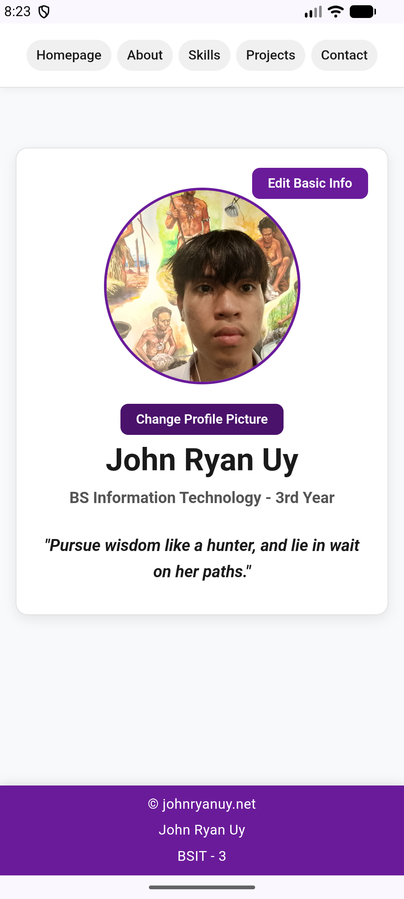
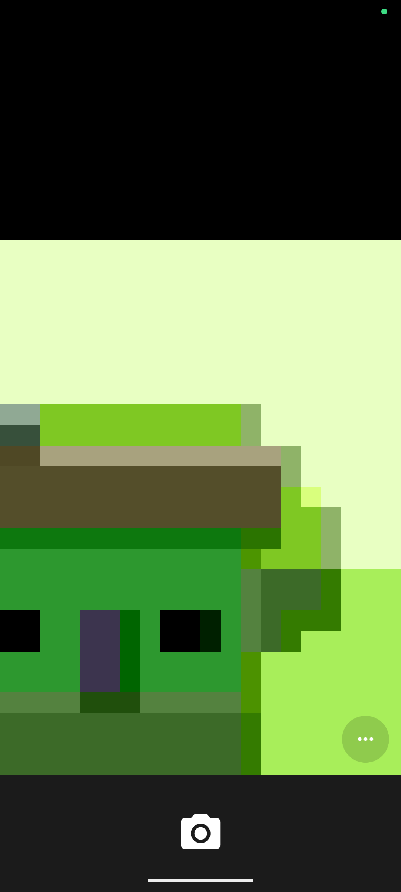
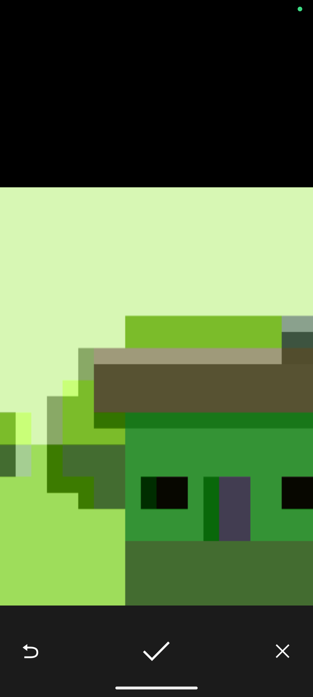
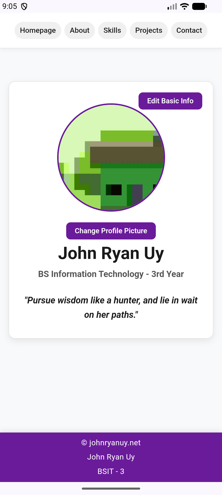

## 1. Project Description
- The Student Profile application is a multi-page mobile application website built with HTML5, CSS3, JavaScript, and packaged with Apache Cordova. The application presents a personal overview, skills, academic background, projects showcase, and contact information.

## 2. Application Pages
### index.html
- Serves as the landing homepage featuring a, quote, introductory profile image, and personal summary. 

### about.html 
- Academic background, web development goals, hobbies, and background aspirations.. 

### skills.html
- It talks about what I learned (and still learning) and the things I'm capable of doing. It has a generic desktop image on the side or below depending on what device you are using

### projects.html
- Features project cards specifying project titles, descriptions, developer roles, and live links.

### contact.html
- Direct communication channels including GitHub profile link, facebook, and email address.

## 3. Profile Editing
The application includes an Edit Basic Info feature that allows the user to update their:

Full Name
Course
Year Level

When the user selects Edit Basic Info, a modal form appears with the current profile information. The user can modify the information and save the changes.
The profile data is stored locally using the browser's Local Storage API. The application uses a storage key called student_profile_data to save the profile information as JSON data.

This allows the updated profile information to remain available even after closing and reopening the application.
The application also uses Local Storage to save the captured profile picture.

## 4. Camera Integration
The application uses the Cordova Camera Plugin to access the device's camera.
The profile picture can be changed using the Change Profile Picture button.

The process is:
Change Profile Picture → Open Camera → Capture Image → Update Profile Picture

When the user selects Change Profile Picture, the application calls Cordova's camera API. The device camera opens and allows the user to capture a photograph.

After the photograph is successfully captured, the camera returns the image data to the application. The captured image then replaces the existing profile picture. The camera configuration also limits the image dimensions and quality to help reduce the amount of data stored locally.

## 5. Device Feature Integration
Cordova is used because it allows a web-based application using HTML, CSS, and JavaScript to access native device features.

In this application, Cordova provides access to the device camera through the camera plugin. Instead of using only standard browser functionality, the application communicates with the device's native camera through the Cordova API.

This makes it possible for the portfolio application to use device hardware while keeping the application's interface and logic based on standard web technologies.

## 6. Image Handling
The Cordova Camera Plugin returns the captured image as image data.

The application uses:
destinationType: Camera.DestinationType.DATA_URL

The returned value already contains the complete image data URL, so it is assigned directly to the profile picture:
const imageSource = imageData;

The image is then saved to the profile object:
current.profilePicture = imageSource;
saveProfile(current);

Finally, the  element is updated:
profilePicture.src = imageSource;

When the application starts, the saved profile picture is loaded from Local Storage and displayed again.

The image dimensions and quality are also limited to help reduce the amount of storage required:
quality: 70,
targetWidth: 600,
targetHeight: 600

## 7. Error Handling
The application includes error handling for different camera situations.

Camera Permission Denial
If the application is unable to access the camera because permission was denied or access is unavailable, an error message is displayed:
Unable to access the camera. Please check your device permissions.
The application does not crash when camera access fails.

Camera Cancellation
If the user opens the camera but cancels without taking a photograph, the existing profile picture remains unchanged.
The application returns to the profile interface without replacing the current image.

Camera Errors
Other camera-related errors are caught by the camera error callback. The error is logged for debugging purposes and an appropriate message is displayed to the user.
The application continues running normally instead of crashing because of the camera error.

## 8. Responsive Design
The application uses responsive HTML and CSS to provide a consistent interface across different screen sizes.

Desktop
On desktop screens, the application uses a wider content area with the navigation links displayed horizontally. The profile card and other content are centered within a maximum-width container.

Tablet
For tablet-sized screens, CSS media queries adjust the layout and spacing. The navigation remains accessible while content can use multiple columns where appropriate.

Mobile
For mobile devices, the application uses a smaller navigation layout, reduced spacing, and a single-column form layout. The footer also changes to a vertical layout to fit smaller screens.

The application uses CSS media queries at different screen widths to adapt the interface without requiring separate versions of the application.

The profile image is also sized using CSS so that it remains properly contained within the profile interface.

## 9. How to Run
Prerequisites

Before running the application, install the following:
Node.js and npm
Apache Cordova
Android Studio and the Android SDK if building for Android
A physical Android device or Android emulator for testing the camera feature

1. Configure the Cordova Project
Open a terminal in the Cordova project directory.

If creating the project from scratch, use:
cordova create myPortfolio

Then enter the project directory:
cd myPortfolio

Place the application's HTML, CSS, JavaScript, and image files inside the project's www folder.

2. Add the Android Platform
Add the Android platform:
cordova platform add android

If the Android platform is already installed, this step does not need to be repeated.

3. Install the Camera Plugin
Install the Cordova camera plugin:
cordova plugin add cordova-plugin-camera

Verify that the plugin is installed:
cordova plugin list

The installed plugins should include:
cordova-plugin-camera

The application accesses the camera through the Cordova camera API provided by this plugin.

5. Build the Application
Build the Android application using:
cordova build android
Cordova will prepare the web application, plugins, and Android platform files and create the Android application package.

6. Run the Application
To run the application on a connected Android device or emulator:
cordova run android

Make sure USB debugging is enabled on a physical Android device, or make sure an Android emulator is running.

## 10. Application Screenshots
### Student Profile

### Change Profile Picture   

### Camera

### Captured Image 

### Updated Profile Picture
  