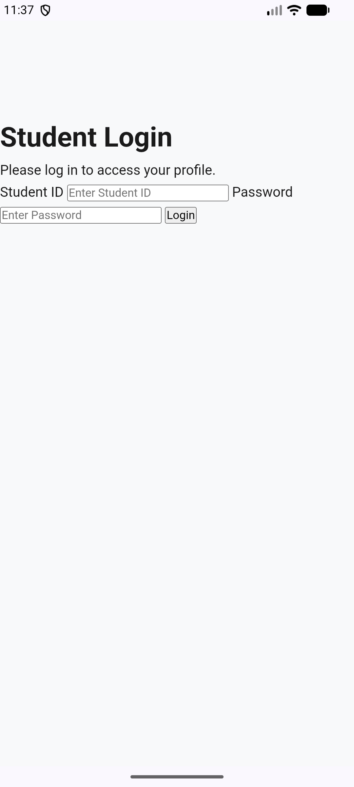
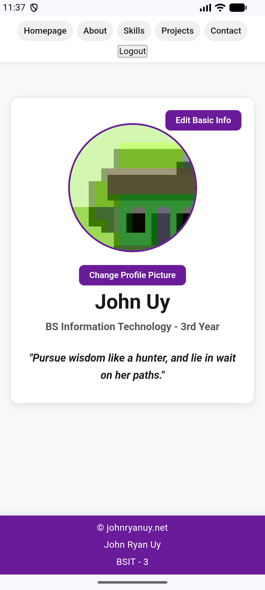
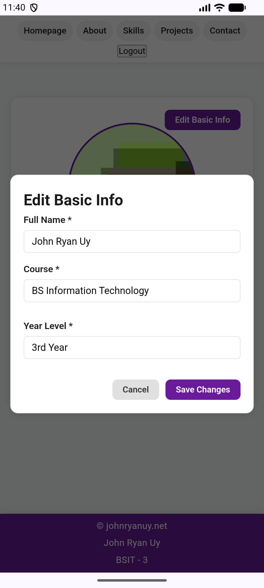
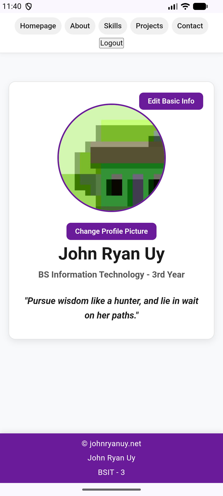
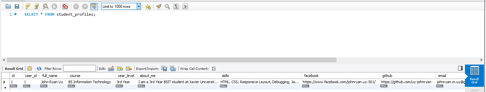

# Student Profile Application

## 1. Project Description

The Student Profile application is a multi-page mobile application built using HTML5, CSS3, JavaScript, and Apache Cordova. It contains the student's profile, academic information, skills, projects, and contact information.

In Activity 7, the application was enhanced from a locally stored profile into a **database-driven application**. It now uses user authentication, a backend API, and a MySQL database to store and retrieve student profile information.

---

## 2. Application Pages

### Profile

The Profile page serves as the main student profile page. It displays the student's name, course, year level, profile picture, and other personal information. Authenticated students can also edit their profile and change their profile picture.

### About

The About page contains the student's academic background, goals, hobbies, and personal information. Authenticated students can edit their About Me information.

### Skills

The Skills page displays the student's technical skills and areas of knowledge. Authenticated students can update their list of skills.

### Projects

The Projects page displays project cards containing project titles, descriptions, roles, and project links.

### Contact

The Contact page provides communication information such as GitHub, Facebook, and email. Authenticated students can update their contact information.

### Login

The Login page allows students to enter their Student ID and password. The credentials are authenticated by the backend before the student can access the protected profile pages.

---

## 3. Authentication

Users log in by entering their Student ID and password on the Login page.

The authentication process follows:

**Login → Authentication → Student Profile**

The backend verifies the submitted credentials. If they are valid, the backend creates an authentication token and sends it to the Cordova application.

If the credentials are invalid, the application displays an error message and does not allow access to the protected profile.

Actual passwords and credentials are not included in this README or the public repository.

---

## 4. Student Profile Management

After successful authentication, the student can:

* View their profile information.
* Edit their name, course, and year level.
* Edit their About Me information.
* Edit their skills.
* Edit their contact information.
* Save changes to the database.
* Update their profile picture using the device camera.
* Log out of the application.

When changes are saved, the application sends the updated information to the backend API, which updates the student's record in the database.

When the student logs out, the authentication token is removed and the application returns to the Login page.

---

## 5. Database Integration

The application uses **MySQL** as its database technology.

The database stores student authentication and profile information, including:

* Student ID
* Name
* Course
* Year Level
* About Me
* Skills
* Facebook
* GitHub
* Email
* Profile Picture/Image Data

The database contains a `users` table for authentication information and a `student_profiles` table for profile information.

Each student profile is associated with a specific user account.

---

## 6. API/Backend

The Cordova application does not connect directly to the MySQL database.

Instead, the application communicates with a backend API built using **Node.js and Express.js**.

The basic architecture is:

**Cordova Application → API/Backend → Database**

The backend handles authentication, profile retrieval, profile updates, profile picture updates, and profile deletion.

The backend also communicates with MySQL using the MySQL2 library.

---

## 7. CRUD Operations

The application demonstrates CRUD operations through the student profile database.

### Create

A student account and corresponding student profile can be created and stored in the database.

### Read

The application retrieves the authenticated student's profile from the database and displays the information on the appropriate pages.

### Update

Authenticated students can edit their profile information and save the changes to the database. Profile pictures can also be updated.

### Delete

The application provides a delete operation for removing an appropriate student account and its associated profile record from the database. A separate test record was used for deletion testing.

---

## 8. Camera Integration

The Activity 6 camera functionality is retained in Activity 7 and integrated with the database-driven system.

The application uses the **Cordova Camera Plugin** to access the device camera.

The process is:

**Change Profile Picture → Open Camera → Capture Image → Save to Database → Display Updated Picture**

The captured image is returned as image data and sent to the backend API. The image is then associated with the authenticated student's profile in the database.

The camera configuration uses reduced image quality and dimensions to help control the amount of data stored.

---

## 9. Data Persistence

Profile information is stored in the MySQL database instead of being stored only in browser Local Storage.

When a student updates their profile, the changes are saved to the database.

The information remains available after:

* Closing the application
* Restarting the application
* Logging out
* Logging in again

After logging in again, the application retrieves the updated profile from the database through the backend API.

This allows profile information to persist across application sessions.

---

## 10. Responsive Design

The application uses responsive HTML and CSS to adapt to different screen sizes.

### Desktop

The application uses a wider content area, horizontal navigation, and centered profile and content sections.

### Tablet

The layout adjusts spacing, content width, and columns using CSS media queries.

### Mobile

The application uses smaller spacing, mobile-friendly navigation, single-column layouts, and responsive forms and profile images.

The same application interface can therefore be used on desktop, tablet, and mobile devices.

---

## 11. Security

The application implements several security measures:

* Passwords are hashed using `bcryptjs` instead of being stored as plain text.
* Authentication is handled by the backend.
* Protected API requests require a valid JWT authentication token.
* Database credentials are stored in environment variables.
* Database credentials are not included directly in the source code.
* Sensitive configuration files such as `.env` are excluded from the public repository.
* The Cordova application does not directly access the MySQL database.
* Database credentials are therefore not exposed to the Cordova application.

---

## 12. How to Run

Follow these steps to set up and run the Student Profile application on another computer.

### Prerequisites

Install the following:

* Node.js and npm
* MySQL Server
* Apache Cordova
* Android Studio
* Android SDK
* Java/JDK compatible with the Cordova Android platform
* An Android emulator or physical Android device

### 1. Clone the Repository

Clone the project repository from GitHub:

```bash
git clone <repository-url>
```

Open the project directory:

```bash
cd <project-folder>
```

### 2. Configure the MySQL Database

Start MySQL Server and create the database:

```sql
CREATE DATABASE student_profile_db;
```

Select the database:

```sql
USE student_profile_db;
```

Create the required `users` and `student_profiles` tables using the SQL structure provided in the project.

A demonstration student account must also be created in the database for testing the login functionality.

### 3. Configure the Backend/API

Open a terminal in the `backend` folder:

```bash
cd backend
```

Install the backend dependencies:

```bash
npm install
```

Create a `.env` file inside the `backend` folder using the provided `.env.example` as a guide.

Configure the following values for the local environment:

```env
PORT=3000
DB_HOST=localhost
DB_USER=your_mysql_username
DB_PASSWORD=your_mysql_password
DB_NAME=student_profile_db
JWT_SECRET=your_random_secret
```

Do not commit the `.env` file or any real passwords or secrets to GitHub.

### 4. Start the Backend/API

From the `backend` folder, run:

```bash
node server.js
```

The backend API will start on port `3000`.

The backend must remain running while using the Cordova application.

### 5. Configure the Cordova Application

Open a new terminal in the main project directory.

Install the required Cordova plugins:

```bash
cordova plugin add cordova-plugin-camera
cordova plugin add cordova-plugin-advanced-http
cordova plugin add cordova-plugin-file
```

If the Android platform has not already been added:

```bash
cordova platform add android
```

The API configuration in `www/js/api.js` should point to the backend server.

For an Android emulator, the development computer can be accessed using:

```text
http://10.0.2.2:3000/api
```

### 6. Build the Application

Build the Android application:

```bash
cordova build android
```

### 7. Run the Application

Start an Android emulator or connect an Android device.

Then run:

```bash
cordova run android
```

The application will open on the Android device or emulator.

### 8. Log In

Once the application starts:

1. Open the Login page.
2. Enter one of the demonstration test accounts provided in this README.
3. The application authenticates the account through the backend.
4. After successful authentication, the student's profile is retrieved from the MySQL database.

The backend/API and MySQL database must be running for login, profile retrieval, profile updates, and profile picture updates to work.

### Important

This project is currently configured as a **local development application**. The backend and MySQL database must be running on the computer hosting the application.

The project does not expose database credentials to the Cordova application. Each person setting up the project should configure their own local `.env` file with their own MySQL credentials and JWT secret.

---

## 13. Test Accounts

A demonstration student account can be created using the Node.js `createTestUser.js` script.

The script creates a test user in the MySQL database with:

* Student ID
* Hashed password
* Student name
* Course
* Year Level
* About Me
* Skills
* Contact information
* Profile picture reference

### Creating a Test Account

Make sure the MySQL database is configured and the backend dependencies have been installed.

Place the `createTestUser.js` file inside the `backend` folder, then run:

```bash
cd backend
node createTestUser.js
```

The script creates the demonstration account and its associated student profile in the database.

After the account has been created, start the backend:

```bash
node server.js
```

The newly created account can then be used to test:

* Login
* Authentication
* Profile retrieval
* Profile editing
* Profile picture updates
* Data persistence
* Logout
* Login after logout

The `createTestUser.js` script should only be used for creating demonstration/test accounts. It should not contain personal passwords or production credentials.

Actual passwords, database passwords, JWT secrets, and other sensitive credentials should not be committed to the public repository.

## 14. Application Screenshots

The following screenshots demonstrate the main functionality of the Activity 7 Student Profile application.

### Login Page



### Successful Login



### Student Profile


### Edit Profile



### Updated Profile



### Profile Picture / Camera


### Logout


### Database-Related Functionality


